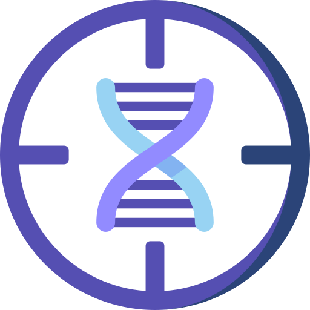

<div id="top"></div>

<!-- PROJECT LOGO -->
<br />
<div align="center">
  <a href="https://github.com/shaojunyu/DNA-probe-efficiency">
    
  </a>

<h3 align="center">DNA Probe Targeting Efficiency</h3>

  <p style="text-align: center">
    A deep learning tool for predicting DNA probe on-target efficiency in targeting sequencing
    <br />
    <a href="https://github.com/github_username/repo_name"><strong>Explore the docs »</strong></a>
    <br />
    <br />
  </p>
</div>


<!-- TABLE OF CONTENTS -->
<details>
  <summary>Table of Contents</summary>
  <ol>
    <li>
      <a href="#about-the-project">About The Project</a>
    </li>
    <li>
      <a href="#getting-started">Getting Started</a>
      <ul>
        <li><a href="#prerequisites">Prerequisites</a></li>
        <li><a href="#installation">Installation</a></li>
      </ul>
    </li>
    <li>
      <a href="#usage">Usage</a>
      <ul>
        <li><a href="#train">Train Model</a></li>
        <li><a href="#predict">Predict</a></li>
      </ul>
    </li>
    <li><a href="#roadmap">Roadmap</a></li>
    <li><a href="#license">License</a></li>
    <li><a href="#contact">Contact</a></li>
    <li><a href="#acknowledgments">Acknowledgments</a></li>
  </ol>
</details>


<!-- ABOUT THE PROJECT -->

## About The Project

[//]: # ([![Product Name Screen Shot][product-screenshot]]&#40;https://example.com&#41;)
A deep learning tool to build models for predicting
On-target efficiency of DNA probes based on their sequence. We provide some sample data and pre-trained models for testing and evaluation. Use this tool with your dataset to train customized models or just predict new datasets with pre-trained models. It can also be easily modified and applied to other sequence regression problems.


<p style="text-align: right">(<a href="#top">back to top</a>)</p>


<!-- GETTING STARTED -->

## Getting Started

This is an example of how you may give instructions on setting up your project locally.
To get a local copy up and running follow these simple example steps.

### Prerequisites

This is an example of how to list things you need to use the software and how to install them.

* npm
  ```sh
  npm install npm@latest -g
  ```

### Installation

1. Get a free API Key at [https://example.com](https://example.com)
2. Clone the repo
   ```sh
   git clone https://github.com/github_username/repo_name.git
   ```
3. Install NPM packages
   ```sh
   npm install
   ```
4. Enter your API in `config.js`
   ```js
   const API_KEY = 'ENTER YOUR API';
   ```

<p align="right">(<a href="#top">back to top</a>)</p>


<!-- USAGE EXAMPLES -->

## Usage

Use this space to show useful examples of how a project can be used. Additional screenshots, code examples and demos
work well in this space. You may also link to more resources.

_For more examples, please refer to the [Documentation](https://example.com)_

<p style="text-align: right">(<a href="#top">back to top</a>)</p>


<!-- ROADMAP -->

## Roadmap

- [x] Predict on-target efficiency based on probe seq
- [ ] Figure out the seq features that lead to high efficiency
- [ ] Design highly efficient probes 
    - [ ] Sequence modification (adaptors, primers)
    - [ ] Verification by experiments


<!-- LICENSE -->

## License

Distributed under the BSD License. See `LICENSE` for more information.

<p style="text-align: right">(<a href="#top">back to top</a>)</p>


<!-- CONTACT -->

## Contact

Shaojun Yu - shaojun.yu@emory.edu  
Zhuqing Zheng - zzq1207@126.com   
Project Link: [https://github.com/shaojunyu/DNA-probe-efficiency](https://github.com/shaojunyu/DNA-probe-efficiency)

<p style="text-align: right">(<a href="#top">back to top</a>)</p>


<!-- ACKNOWLEDGMENTS -->

## References

* [https://www.idtdna.com/pages/technology/next-generation-sequencing/dna-sequencing/targeted-sequencing](https://www.idtdna.com/pages/technology/next-generation-sequencing/dna-sequencing/targeted-sequencing)
* [https://github.com/genetic-medicine/PaddleHelix_RNA_UPP](https://github.com/genetic-medicine/PaddleHelix_RNA_UPP)
* Ma, X. et al. (2019) ‘Analysis of error profiles in deep next-generation sequencing data’, Genome Biology, 20(1), p. 50. doi:10.1186/s13059-019-1659-6.
* Kim, H.K. et al. (2018) ‘Deep learning improves prediction of CRISPR–Cpf1 guide RNA activity’, Nature Biotechnology, 36(3), pp. 239–241. doi:10.1038/nbt.4061.
* Huang, L. et al. (2019) ‘LinearFold: linear-time approximate RNA folding by 5’-to-3’ dynamic programming and beam search’, Bioinformatics, 35(14), pp. i295–i304. doi:10.1093/bioinformatics/btz375.
* Sato, K., Akiyama, M. and Sakakibara, Y. (2021) ‘RNA secondary structure prediction using deep learning with thermodynamic integration’, Nature Communications, 12(1), p. 941. doi:10.1038/s41467-021-21194-4.

<p style="text-align: right">(<a href="#top">back to top</a>)</p>


<!-- MARKDOWN LINKS & IMAGES -->
<!-- https://www.markdownguide.org/basic-syntax/#reference-style-links -->

[contributors-shield]: https://img.shields.io/github/contributors/github_username/repo_name.svg?style=for-the-badge

[contributors-url]: https://github.com/github_username/repo_name/graphs/contributors

[forks-shield]: https://img.shields.io/github/forks/github_username/repo_name.svg?style=for-the-badge

[forks-url]: https://github.com/github_username/repo_name/network/members

[stars-shield]: https://img.shields.io/github/stars/github_username/repo_name.svg?style=for-the-badge

[stars-url]: https://github.com/github_username/repo_name/stargazers

[issues-shield]: https://img.shields.io/github/issues/github_username/repo_name.svg?style=for-the-badge

[issues-url]: https://github.com/github_username/repo_name/issues

[license-shield]: https://img.shields.io/github/license/github_username/repo_name.svg?style=for-the-badge

[license-url]: https://github.com/github_username/repo_name/blob/master/LICENSE.txt

[linkedin-shield]: https://img.shields.io/badge/-LinkedIn-black.svg?style=for-the-badge&logo=linkedin&colorB=555

[linkedin-url]: https://linkedin.com/in/linkedin_username

[product-screenshot]: images/screenshot.png